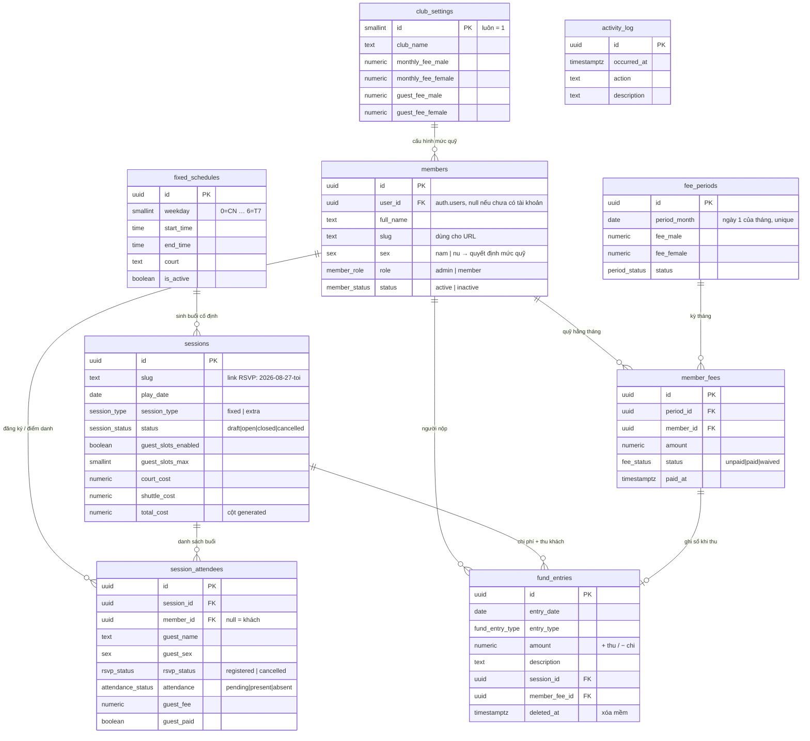

# Backend — CLB Cầu Lông

NestJS 11 + TypeORM + PostgreSQL (Supabase). Phục vụ frontend Next.js trong
`../frontend`: khu Admin, khu Member (`/m`) và trang RSVP công khai (`/rsvp/[slug]`).

Tài liệu này gồm hai phần: **ứng dụng NestJS** và **database**.

---

# Phần 1 — Ứng dụng NestJS

## Chạy thử

```bash
cp .env.example .env.local     # điền URL và key của Supabase
npm install
supabase start                 # Postgres cục bộ + Studio
supabase db reset              # chạy migrations + seed
npm run start:dev
```

- API: http://localhost:3333/api/v1
- Swagger: http://localhost:3333/docs
- Health: http://localhost:3333/api/v1/health

## Cấu trúc thư mục

```
src/
├── main.ts                    # bootstrap: CORS, helmet, ValidationPipe, Swagger, prefix /api/v1
├── app.module.ts              # ghép module + đăng ký guard/filter toàn cục
├── config/
│   ├── configuration.ts       # gom biến môi trường thành object có kiểu
│   ├── env.validation.ts      # Joi — thiếu biến là app không boot
│   └── config.module.ts
├── common/                    # dùng chung, không phụ thuộc module nghiệp vụ nào
│   ├── enums.ts               # khớp 1-1 với enum type trong Postgres
│   ├── decorators/            # @Public, @Roles, @CurrentMember
│   ├── dto/                   # PaginationDto, PaginatedResult
│   ├── filters/               # map lỗi Postgres sang HTTP đúng nghĩa
│   ├── interceptors/          # log thời gian xử lý
│   ├── transformers/          # numeric của Postgres -> number
│   └── utils/
├── database/
│   ├── database.module.ts     # TypeOrmModule.forRootAsync
│   ├── data-source.ts         # DataSource cho TypeORM CLI
│   ├── db-functions.service.ts# cầu nối tới các hàm SQL (chốt buổi, thu quỹ, RSVP)
│   ├── entities/              # 9 entity ánh xạ 9 bảng
│   └── views/                 # 5 ViewEntity chỉ đọc
└── modules/
    ├── auth/                  # verify JWT Supabase + guard phân quyền
    ├── supabase/              # supabase-js phía server (Auth Admin, Storage)
    ├── settings/              # cấu hình CLB, mức quỹ, phí khách
    ├── members/               # thành viên
    ├── schedules/             # lịch cố định hàng tuần + sinh buổi
    ├── sessions/              # buổi đánh, đăng ký, điểm danh, chốt buổi
    ├── fees/                  # kỳ quỹ tháng, thu quỹ
    ├── fund/                  # sổ quỹ CLB
    ├── rsvp/                  # 3 endpoint công khai cho link đăng ký
    ├── leaderboard/           # xếp hạng theo giá thực mỗi buổi
    ├── dashboard/             # số liệu trang Tổng quan
    └── health/                # health check
```

Mỗi module nghiệp vụ theo cùng một khuôn: `*.module.ts`, `*.controller.ts`
(chỉ định tuyến và mô tả Swagger), `*.service.ts` (toàn bộ logic), `dto/`
(class-validator). Thêm module mới chỉ cần copy khuôn của `settings` — nó là
module nhỏ nhất và đầy đủ nhất.

## Xác thực và phân quyền

Frontend đăng nhập bằng `supabase-js`, gửi access token trong header
`Authorization: Bearer <token>`.

1. `SupabaseAuthGuard` (guard toàn cục) verify chữ ký token.
2. `AuthService.resolveUser` tìm bản ghi `members` theo `user_id`; nếu chưa có
   thì khớp theo email và tự gắn — đúng luồng "admin tạo thành viên trước,
   người đó đăng ký sau bằng chính email đó".
3. `RolesGuard` chặn theo `@Roles(MemberRole.ADMIN)`.

### Verify token: JWKS hay Legacy secret

Supabase có hai kiểu ký JWT và `AuthService` tự nhận diện theo header `alg`:

| Kiểu | Thuật toán | Backend cần gì |
|---|---|---|
| **JWT Signing Keys** (mặc định hiện nay) | ES256 / RS256 | Không cần gì thêm — lấy public key từ `<SUPABASE_URL>/auth/v1/.well-known/jwks.json` |
| **Legacy JWT Secret** (project cũ) | HS256 | `SUPABASE_JWT_SECRET` |

Đường JWKS được ưu tiên: `jose` cache bộ khóa và chỉ gọi lại khi gặp `kid` lạ,
nên bấm **Rotate keys** trên dashboard là backend tự lấy khóa mới, không phải
deploy lại. Vì khóa bất đối xứng, backend chỉ giữ public key — không có secret
nào để lộ.

Đặt `SUPABASE_JWT_SECRET` chỉ khi project của bạn vẫn còn ký HS256. Trong lúc
chuyển đổi có thể khai báo cả hai: token HS256 cũ chưa hết hạn và token ES256
mới đều verify được cùng lúc.

Mặc định **mọi route đều phải đăng nhập**. Mở ra bằng `@Public()` —
hiện chỉ có `health` và `rsvp`.

```ts
@Post()
@Roles(MemberRole.ADMIN)
create(@CurrentMember() user: AuthenticatedUser, @Body() dto: CreateSessionDto) {
  return this.service.create(dto, user.member!.id);
}
```

## Vì sao có `DbFunctionsService`

Các thao tác đụng tới tiền — chốt buổi, thu quỹ, mở kỳ — đã được viết thành hàm
SQL trong `supabase/migrations`. Backend **gọi lại chính các hàm đó** thay vì
viết lại bằng TypeORM, vì hai lý do:

- Chúng phải nguyên tử: chốt buổi vừa cập nhật buổi, vừa điểm danh phần còn lại,
  vừa ghi hai dòng sổ quỹ. Một transaction trong DB là chắc chắn nhất.
- Frontend có thể gọi thẳng qua `supabase.rpc()` mà không đi qua backend. Giữ
  một bản logic duy nhất thì hai đường đi không bao giờ lệch nhau.

`runAsUser()` set claim JWT vào transaction để `require_admin()` bên trong hàm
SQL nhận đúng danh tính người gọi, dù backend kết nối bằng vai trò sở hữu DB.

Các thao tác CRUD thường (thành viên, lịch, sửa buổi) vẫn dùng repository
TypeORM như một dự án NestJS bình thường.

## Danh sách endpoint

Tiền tố `/api/v1`. Xem chi tiết tham số ở Swagger.

| Nhóm | Endpoint | Quyền |
|---|---|---|
| auth | `GET /auth/me` | đăng nhập |
| settings | `GET /settings` · `PATCH /settings` | xem: mọi người · sửa: admin |
| members | `GET /members` · `GET /members/fee-status` · `GET /members/:idOrSlug` · `GET /members/:idOrSlug/fees` | đăng nhập |
| members | `PATCH /members/me` | tự sửa hồ sơ |
| members | `POST /members` · `PATCH /members/:idOrSlug` · `DELETE /members/:idOrSlug?hard=` | admin |
| schedules | `GET /schedules` · `POST /schedules` · `PATCH /schedules/:id` · `DELETE /schedules/:id` | xem: mọi người · sửa: admin |
| schedules | `POST /schedules/generate-sessions` | admin |
| sessions | `GET /sessions` · `/upcoming` · `/today` · `/me` · `/:idOrSlug` · `/:idOrSlug/attendees` | đăng nhập |
| sessions | `POST /sessions/:idOrSlug/rsvp` | tự đăng ký |
| sessions | `POST /sessions` · `PATCH` · `/open` · `/close` · `/reopen` · `/cancel` · `/guests` · `/attendance` | admin |
| fees | `GET /fees` · `/periods` · `/overview` · `/unpaid` · `/me` | đăng nhập |
| fees | `POST /fees/periods` · `POST /fees/pay` · `POST /fees/:feeId/unpay` | admin |
| fund | `GET /fund/balance` · `GET /fund/ledger` | đăng nhập |
| fund | `POST /fund/expenses` · `POST /fund/incomes` · `DELETE /fund/entries/:id` | admin |
| leaderboard | `GET /leaderboard` · `GET /leaderboard/me` | đăng nhập |
| dashboard | `GET /dashboard` · `GET /dashboard/activities` | admin / đăng nhập |
| rsvp | `GET /rsvp/:slug` · `POST /rsvp/:slug/toggle` · `POST /rsvp/:slug/guests` | **công khai** |

## Biến môi trường

Xem `.env.example`.

| Biến | Lấy ở đâu |
|---|---|
| `SUPABASE_URL` | Settings → API |
| `SUPABASE_ANON_KEY` | Settings → API Keys (publishable / anon) — key công khai, an toàn khi để ở frontend |
| `SUPABASE_SERVICE_ROLE_KEY` | Settings → API Keys (secret) — **chỉ dùng ở backend**, bỏ qua RLS |
| `SUPABASE_JWT_SECRET` | Settings → JWT Keys → tab *Legacy JWT Secret*. Bỏ trống nếu project dùng JWT Signing Keys |
| `DATABASE_URL` | Settings → Database → Connection string (URI) |

## Lệnh hay dùng

```bash
npm run start:dev     # dev, watch mode
npm run build         # build ra dist/
npm run lint          # eslint --fix
npm test              # unit test
npm run schema:check  # in ra SQL mà TypeORM cho là còn lệch so với entities
npm run gen:types     # sinh type TypeScript cho frontend
```

`schema:check` là cách nhanh nhất để phát hiện entity đã lệch khỏi migration —
nếu nó in ra lệnh SQL nào đó nghĩa là hai bên không còn khớp.

---

# Phần 2 — Database

Schema do các file SQL trong `supabase/migrations` quản lý, **không phải
TypeORM** (`synchronize: false`) — vì chúng còn chứa RLS, view, function và
trigger mà TypeORM không sinh được. Entities chỉ ánh xạ để đọc/ghi.

## Nguyên tắc nghiệp vụ được mã hóa trong schema

1. **Quỹ tính theo THÁNG, không theo buổi.** Mức quỹ phụ thuộc giới tính
   (nam 400.000 ₫, nữ 280.000 ₫ = 70%). Không đi một buổi cố định thì mất lượt,
   không hoàn — nên không có bảng "công nợ theo buổi".
2. **Khách trả theo buổi** (nam 70.000 ₫, nữ 49.000 ₫) và tiền này chảy vào quỹ CLB.
3. **Sổ quỹ là nguồn sự thật duy nhất về số dư.** `fund_entries.amount` dương là
   thu, âm là chi; số dư = tổng các dòng chưa xóa mềm. Không lưu sẵn cột
   "balance" nào để tránh lệch số.
4. **Chụp lại (snapshot) mọi mức giá.** `fee_periods.fee_male/fee_female` và
   `sessions.guest_fee_*` giữ mức tại thời điểm phát sinh, nên sửa cấu hình CLB
   hôm nay không làm sai lịch sử tháng trước.
5. **Giá thực mỗi buổi** (bảng xếp hạng) = quỹ tháng ÷ số buổi đã có mặt trong
   tháng đó — tính trong view, không lưu.

## Sơ đồ quan hệ

Bản đầy đủ để xem/chỉnh trên [dbdiagram.io](https://dbdiagram.io/d):
`supabase/erd.dbml` — dán nội dung file vào editor bên trái là ra sơ đồ.



## Các bảng

| Bảng | Entity | Vai trò |
|---|---|---|
| `club_settings` | `ClubSettings` | Cấu hình CLB, mức quỹ, phí khách (1 dòng duy nhất) |
| `members` | `Member` | Thành viên CLB, gắn tùy chọn với `auth.users` |
| `fixed_schedules` | `FixedSchedule` | Khung giờ cố định hàng tuần |
| `sessions` | `PlaySession` | Từng buổi đánh (cố định hoặc phát sinh) |
| `session_attendees` | `SessionAttendee` | Đăng ký + điểm danh, gồm cả khách |
| `fee_periods` | `FeePeriod` | Kỳ quỹ theo tháng, chụp mức quỹ của tháng đó |
| `member_fees` | `MemberFee` | Khoản quỹ tháng của từng thành viên |
| `fund_entries` | `FundEntry` | Sổ quỹ CLB (thu/chi) |
| `activity_log` | `ActivityLog` | Nhật ký cho card "Hoạt động gần đây" |

## Views

| View | ViewEntity | Trả về |
|---|---|---|
| `v_fund_balance` | `FundBalanceView` | Số dư quỹ, tổng thu, tổng chi |
| `v_fund_ledger` | — | Sổ quỹ đã lọc dòng xóa, kèm số dư lũy kế |
| `v_session_summary` | `SessionSummaryView` | Mỗi buổi: số nam/nữ đăng ký, số khách, slot còn lại, thu–chi |
| `v_session_attendees` | — | Danh sách điểm danh + trạng thái quỹ tháng của từng người |
| `v_member_month_stats` | — | Theo tháng: quỹ, số buổi đi, giá thực mỗi buổi |
| `v_leaderboard` | `LeaderboardView` | Trên + thứ hạng |
| `v_member_current_fee` | `MemberCurrentFeeView` | Tình trạng quỹ tháng hiện tại |
| `v_month_overview` | `MonthOverviewView` | Đã đóng / chưa đóng / còn thiếu của một tháng |

Tất cả view đặt `security_invoker = true` nên RLS của bảng gốc vẫn được áp dụng.

## Functions

**Công khai — cho `anon`, dùng ở trang `/rsvp/[slug]`:**

| Hàm | Việc |
|---|---|
| `rsvp_get_session(slug)` | Trả JSON: thông tin buổi + danh sách thành viên kèm cờ đã đăng ký + slot khách |
| `rsvp_toggle_member(slug, member_id)` | Bấm tên để đăng ký / bỏ đăng ký |
| `rsvp_add_guest(slug, ten, gioi_tinh)` | Thêm khách, tự lấy phí theo giới tính, chặn khi hết slot |

**Cho admin (đăng nhập, `role = 'admin'`):**

| Hàm | Việc |
|---|---|
| `open_fee_period(thang)` | Tạo kỳ tháng + sinh `member_fees` cho mọi thành viên active |
| `pay_member_fees(fee_ids[], ngay, phuong_thuc)` | Đánh dấu đã đóng **và** ghi sổ quỹ trong cùng một transaction |
| `unpay_member_fee(fee_id)` | Hoàn tác thu quỹ (xóa mềm dòng sổ quỹ tương ứng) |
| `generate_fixed_sessions(tu, den)` | Sinh buổi cố định từ `fixed_schedules` |
| `close_session(id, tien_san, tien_cau, khac, diem_danh_mac_dinh)` | Chốt buổi: ghi chi phí + thu khách vào quỹ, khóa buổi |
| `reopen_session(id)` | Mở lại buổi đã chốt, gỡ các dòng quỹ của buổi đó |
| `cancel_session(id, ly_do)` | Hủy buổi và hủy toàn bộ đăng ký |

## Phân quyền (RLS)

RLS là lớp phòng thủ thứ hai: kể cả khi frontend gọi thẳng Supabase không qua
backend thì vẫn không lộ dữ liệu.

- `anon` **không đọc/ghi được bảng nào** — chỉ đi qua 3 hàm `rsvp_*`.
- Thành viên đăng nhập: đọc dữ liệu CLB, tự sửa hồ sơ của mình
  (trigger chặn sửa `sex` / `role` / `status`), tự đăng ký buổi đang mở.
- Admin: toàn quyền.
- Sổ quỹ và `member_fees` để công khai trong CLB cho minh bạch. Muốn kín hơn,
  sửa policy `member_fees_read` / `fund_entries_read` trong `20260829000004_rls.sql`.

> Lưu ý về link RSVP: ai có link đều bấm được tên người khác — đúng như thiết kế
> UI hiện tại ("bấm vào tên bạn để đăng ký"). Nếu muốn siết, thêm cột `rsvp_token`
> vào `sessions` và yêu cầu token trong ba hàm `rsvp_*`.

## Dữ liệu mẫu

`supabase/seed.sql` dựng đúng bối cảnh trong UI (tháng 8/2026): 16 thành viên
(9 nam, 7 nữ), 8 buổi đã chốt, buổi 27/08 đang mở, 14/16 đã đóng quỹ.
Sau khi seed:

- `v_fund_balance` → **5.020.000 ₫**
- `v_month_overview` → đã thu 4.880.000 ₫, còn thiếu 680.000 ₫ (2 người)
- `v_leaderboard` → Lê Quang Duy 50.000 ₫/buổi (400.000 ÷ 8 buổi)

Tài khoản admin mẫu: `admin@gmail.com` — tạo user trong Supabase Auth với email
này, trigger `handle_new_auth_user` sẽ tự gắn vào dòng `members` tương ứng.

## Bước sau (đã chừa chỗ sẵn)

- **Giải đấu nội bộ**: thêm `tournaments`, `tournament_matches`, `match_players`;
  `sessions` đã có `session_type` để mở rộng thêm giá trị `tournament`.
- **Xếp hạng theo trình độ**: thêm bảng `match_results` + cột điểm Elo trên
  `members`; view `v_leaderboard` hiện tại xếp theo "giá thực mỗi buổi" nên
  không xung đột.
- **Nhắc đóng quỹ**: `activity_log` + một bảng `notifications` nhỏ là đủ.
